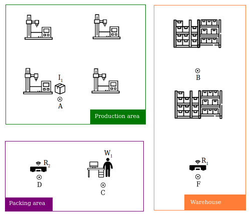

#Business Process Optimization (BPO) module 

The Business Process Optimization (BPO) <sup>1</sup> module determines an optimized solution to the optimized 
motion task sequencing problem. The major focus of BPO are actions that have to be executed by 
factory floor agents (where agent is considered as any logistic entity, such as humans, AGVs etc.)
to carry out logistics motion tasks. BPO takes as input a description of the capabilities of the 
environment, the agents, the cost of the agents’ actions and the expected system state as a task 
specification in a language specifically developed for this module.

The Business Process Optimization module is a stand-alone component that handles the on-the-fly 
optimization of a task. The BPO module is tasked with minimizing the logistic resources required 
and the total cost of the task. BPO contains information regarding the state of each agent 
involved during the task execution.

The input required is called task specification, and it is written and parsed in a language 
specifically developed for the needs of this module containing the agents' and the environment 
definition, the agents capabilities and constraints, the current state of the agents 
(i.e. the current location of each agent) and a logistic task 
(i.e. “Transport _item_1_ to location _B_”) provided by the 
production manager. Agents capabilities contain the allowed state transitions whereas 
agents constraints contain the forbidden state transitions utilizing the topology map created 
by the Central Sensing and Perception (Central SP) module of OPIL Logistics Library. 
Finally, BPO produce the sequence of actions as steps of the shortest path from the initial state
of the agents to a target state subject to the constraints imposed and the capabilities provided.


***
<sup>1</sup> OPIL module: Business Process Optimization (BPO) Robotics, Control and Decision Systems (RCDS)
Laboratory of Cyprus University of Technology (CUT), written and equivalently contintributed 
by Anatoli Tziola, George Georgiades, Savvas G. Loizou from February 2019.

<div style="page-break-after: always"></div>


##Optimization of Logistics processes  
Manufacturing SMEs can use the Business Process Optimization to optimize the logistics resources required 
for their factory floor motion tasks (AGVs, humans, factory floor design/routing) and determine an optimized
solution to the optimized motion task sequencing problem. The major focus of BPO are actions that have to be 
executed by factory floor agents (humans, machines, products, AGVs etc.) to carry out logistics motion tasks.

A case study is presented related to manufacturing logistics workflow to understand better the functionality 
and the applicability of the module.

The main benefits of this case are:
* Improvement of productivity by reducing the manual transportation of parts/products.
* Interaction between human machine operators and AGVs.
* Quality control improvement by reducing the transportation errors when the parts/products are transported inside the factory.
* Dependability owing to automatic assignment of AGV when parts/products are ready for transportation.

###Case study: Optimization of manufacturing logistics 

Use case: _"An item is produced at Production area. The worker operator should load the item on a robot. The robot
should transport the item at Warehouse for storage."_

We assume that the agents are on their initial state as shown in the plant below. The objective task is to
transport `I1` to `B` in minimum time. The BPO determines who agents should be involved in the task execution, 
the motion task actions that needs to be performed by the agents and the total time required to complete the given task.

One solution of this is the case of the utilization of `R1` to transport the item from `A` to `B` since it is more close
to location `A`. In this case, the optimal solution will require the agents `W1`, `R1` and `I1`. The optimal motion task actions
will be:
1. `W1` moves from `C` to `A`.
2. `R1` moves from `F` to `A`.
3. `W1` loads `I1` on `R1`.
4. `R1` carrying `I1` is moving from `A` to `B`.
5. `W1` moves from `A` to `B`.
6. `W1` unloads `I1` from `R1` at `B`.




<div style="page-break-after: always"></div>

##Start guide
In the following, a start guide of how to integrate BPO module is described in detail.


###BPO Task Specification
To begin with, it is needed to set up the input required of the BPO module, called task specification. 
The user creates the task specification written in the language secifically developed for the needs of the module.

###How to Set Up a Task Specification
Here is an example of the task specification. 
At the moment, we address a single robot-human-item problem. 

`BPOSpecificationInput.json`
```
{
   "Environment":{
    "locations":{
        "Name":["Warehouse", "Production_area1", "Production_area2", "Starting_point_1", "Charging_area", "on_robot_1"],
        "Letter":["A", "B", "C", "D", "F", "R"]
    },
    
    "robot_1": [ "A", "B", "C", "D", "F"],
    "human_1": [ "A", "B", "C", "D"],
    "item_1":  [ "A", "B", "C", "D", "R"]
    },
    
   "Constraints":{
    "robot_1":{
        "A":[ "B", "C", "D", "F" ],
        "B":[ "A", "C", "D" ],
        "C":[ "A", "B", "D" ],
        "D":[ "A", "C", "B" ],
        "F":[ "A" ]
    },
        
    "human_1":{
        "A":[ "B", "C", "D" ],
        "B":[ "A" ],
        "C":[ "A", "B" ],
        "D":[ "A", "C" ]
    },
    
    "item_1":{
        "A": [ "R" ],
        "B": [ "R" ],
        "C": [ "R" ],
        "D": [ "R" ],
        "R": [ "A", "B", "C", "D" ]
    }
   },
   
   "Starting_point":{
    "robot_1": [ "F" ],
    "human_1": [ "D" ],
    "item_1":  [ "A" ]
   },
    
   "Objective":{
    "item_1": [ "D" ]
   }
}
```

`"locations": "Name"` defines the locations in the floor that the robots, humans and items could be. 
The names should be the same as the ones used in the annotation file as processed by the Central SP 
(see the relevant installation guide of Central SP). 
The robot agent could transport from location `"A"` to `"B", "C", "D", "F"`. 
The locations named as `"on_robot_1"` defines the `"loading"` status when the robot is carrying an item. 
For the example above, the item can be loaded on the robot (notated as `"R"`) from locations 
`"A", "B", "C"` (`"A":"R", "B":"R", "C":"R"` and could be "unloaded" from robot to "A", "B", "C"`) 
and could be `"unloaded"` from robot to `"A", "B", "C"` (`"R":["A","B","C"]`).


**IMPORTANT: Do not omit the `"loading"` or `"unloading"` status transitions, since the item could 
not be loaded or unloaded from/on the robot. Otherwise, the planner will not be able to find the solution 
to the given task.**

`"locations": "Letter"` is to set a unique alphabet letter for each predefined location respectively. 
For the example above, `"Warehouse"` is notated with `"A"` and `"on_robot_1"` is notated with `"R"`. 
Using the `"Letter"` notations, define the location that an agent is possible to move. 
For example, the robot agent could be at `"Warehouse"`, `"Production_area1"`, `"Production_area2"`, 
`"Starting_point_1"`, `"Charging_area"`. An item could be at `"Warehouse"`, `"Production_area1"`, 
`"Production_area2"`, `"on_robot_1"`. 
**IMPORTANT: Do not forget to include the letter notation for the robot in order to determine that 
the item is loading on the robot.**


`"Constraints"` enable all the possible transitions from a location to another. 
For example, the robot agent could transport from location `"A"` to `"B"`, `"C"`, `"D"`, `"F"` 
or the item can be loaded on the robot (notated as `"R"`) from locations `"A"`, `"B"`, `"C"`.

`"Starting_point"` is the current location of each agent. 
For example, robot is at `"Charging_area"`, human is at `"Starting_point_1"` and item is at `"Warehouse"`.

Since we have set up the environment, we can now determine the task that BPO is going to solve. 
The solution is the optimal task plan which determines the shortest task sequence of actions performed by 
the agents in order to fulfill the desired task ```"item_1":"D" ```. The desired task is defined at 
`"Objective"` and refers to the destination location of _item_1_. 
More specifically, the item needs to be transported from location `"A"` 
(current location extracted from the `"Warehouse"`) to location `"D"` (`"Starting_point_1"`).


###BPO results explanation
The BPO module seeks for the optimal solution for the given task "Transport _item_1_ at location _D_". 
The BPO result consists of the shortest path and the time needed for the agents to complete the given task. 
The shortest path determines the fewer agents actions that should be performed by the agents 
(robot, human, item) to complete the given task. Time is the seconds needed to complete the given task. 
Following the task specification example, here is the path explanation.

The BPO output published on OCB as opil_bpo. Results entity has 2 attributes: 1. path, 2. time.

Following the given task specification example, the path will have 7 steps:

```
FDA, ADA, AAA, AAR, ADR, DDR, DDD
```

Each step is a string composed by letter as many as the agents are. 
At the moment, each string has 3 letters, one for each agent. 
The first letter refers to the robot, the second letter refers to the human and the third letter refers to the item. So, user is aware about the current position of the agents at any time during the task execution. Only one change per agent is allowed in every step for the robust control of the process.


* Step 1: The starting point of the agents.
* Step 2: Robot is moving first from F to A.
* Step 3: Robot reached location A. Now, human is moving from D to A. All the agents are at location A where the item is stored.
* Step 4: Human loads the item on the robot at location A.
* Step 5: Human goes from A to location D.
* Step 6: Robot goes from A to D carrying the item.
* Step 7: Human unloads the item from the robot at location D.

`"time"` determines the timed needed for the agents to perform the actions (in seconds) from the Step 1 to 7. 
Time required for this example is 63 seconds.

<div style="page-break-after: always"></div>


## How to run the BPO module
The guide is tested with docker version 18.09.6 and docker-compose version 1.24.0. Supported $ROS_DISTRO is kinetic.

### Starting from docker container
To start the BPO service, pull the BPO docker image from [docker.ramp.eu](https://docker.ramp.eu/) 
and run the docker image on your local computer.

```
docker pull docker.ramp.eu/mod.ro.bpo:latest
docker run -it docker.ramp.eu/mod.ro.bpo:latest bash
```
